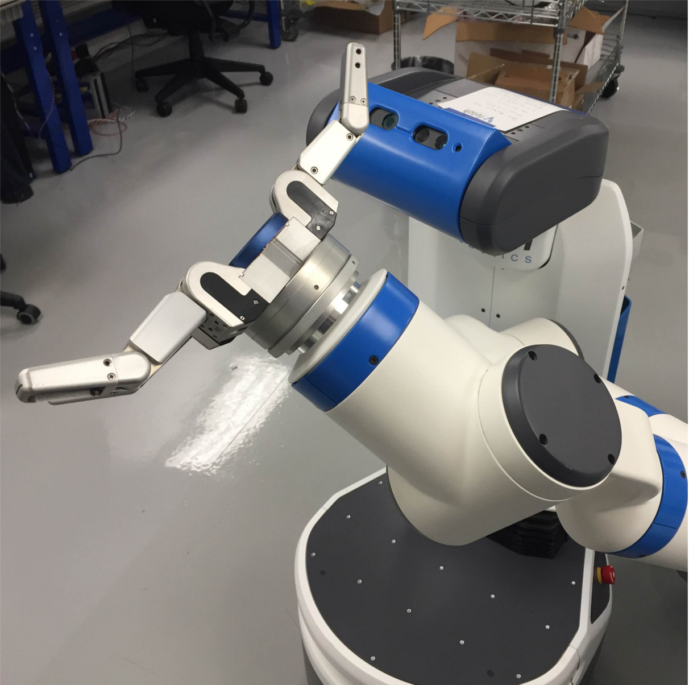

Barrett Hand BH-282 Fetch Integration Documentation
---------------------------------------------------

Overview
~~~~~~~~

The Barrett Hand is a three fingered hand from Barrett Technologies. The
hand uses CAN-BUS or RS-232 for communication, these connectors connect
to a control box which handles both the power supply and the
communications of the hand. For this particular setup a USB to CAN
adapter is used (Preferably from PEAK)

Tried and tested on
~~~~~~~~~~~~~~~~~~~

Operating System : Linux Ubuntu 14.04.3 LTS

Kernel Version : 3.16.0-45-generic

Software Setup:
~~~~~~~~~~~~~~

.. note::  Before installing the ROS driver, the latest version of the Peak CAN drivers must be installed. Please note that for recent kernel versions, only the recent version of the Peak CAN drivers will work properly.

Peak CAN drivers and python wrappers installation :

::

   >$ sudo apt-get install swig

Installing POPT

Go to http://www.linuxfromscratch.org/blfs/view/svn/general/popt.html

Download popt-1.16.tar.gz and extract it,

::

   >$ ./configure --prefix=/usr --disable-static && make

   >$ sudo make install

Peak CAN Drivers:

Go to http://www.peak-system.com/ and download the latest version of the
Peak CAN drivers.

once downloaded, extract the package,
::
   >$ make NET=NO_NETDEV_SUPPORT

   >$ sudo make install

Pcan Python:

Once the Peak CAN drivers are installed,
::

   >$ git clone https://github.com/RobotnikAutomation/pcan_python.git

   >$ make

   >$ sudo make install

Add /usr/lib to the PYTHONPATH in order to find the module.

::

   >$ Example: export PYTHONPATH=/usr/lib:$PYTHONPATH

Once all these drivers have been installed without any errors, the ROS
drivers/Controller can be used.

ROS Driver Installation:

::

   >$  mkdir -p ~/bhand/src

   >$  cd bhand/src

   >$  catkin_init_workspace

   >$  cd ..

   >$  catkin_make

   >$  cd src

   >$  git clone https://github.com/RobotnikAutomation/barrett\_hand

   >$  cd ..

   >$  catkin_make

   >$  source devel/setup.bash

Now the ROS drivers have been installed and ready to use

To launch the controller,
::
  >$ roslaunch bhand_controller bhand_controller.launch

The controller will show CAN Error if the CAN drivers have not been
installed properly.

To control the barrett hand, through the RQT interface,
::
   >$ rosrun rqt_bhand rqt_bhand
