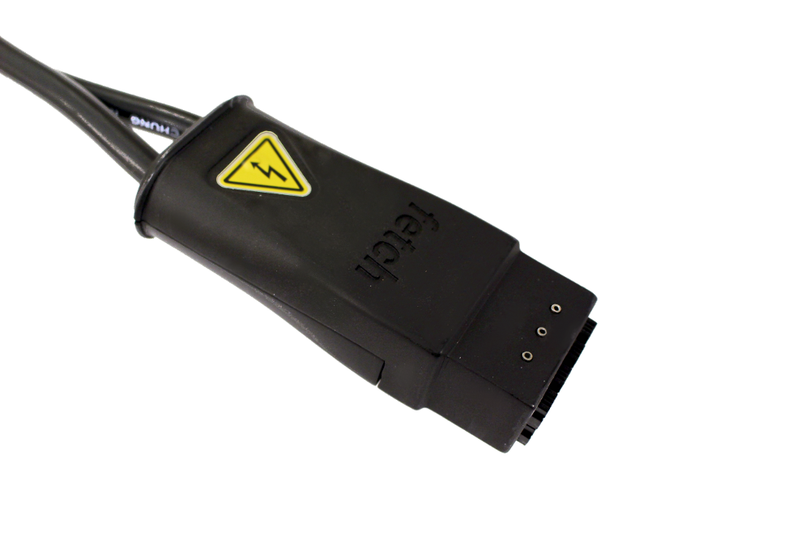

Care And Feeding
================

.. _charging:

Charging
--------

The robot can be charged by plugging the supply connector of the power
brick into the front of the robot or by docking with the robot charge
dock. When using the supply connector, make sure the "Fetch" logo is
facing up, otherwise the connector will not properly mate:

The connector needs roughly 100 newtons (24 lbs) of force to plug in.
If it seems the connector will not mate with this much force, check
the plug and connector for damage or foreign objects.

The charge indicator light on the :ref:`access_panel` indicates
the status of the battery and charging:

================= =================
Charge Indicator  Meaning
================= =================
Solid Green       Robot is fully charged
Blinking green    Robot is charging
Solid Red         Battery voltage is low
Blinking red      Charging error has occurred
================= =================

The charge indicator light will flash green when the robot is charging.
When the robot is completely charged the indicator light will stay
solid green.

The charge indicator light will turn red when the battery voltage is low.
When the charge indicator turns red, you should recharge the robot.
If the battery voltage gets low enough, the robot will automatically
turn off.

In some cases, the charging circuit may detect an error condition
and will flash the charging indicator red. After about 1 minute, the
charger will attempt charging again. If the error condition persists,
a support ticket should be created to address the problem.

.. note::

   One notable charging error is caused by the :ref:`power_disconnect` being switched off.
   When the power disconnect is switch off, it disconnects the battery which prevents the
   charger from working. When the charger detects this situation it will flash both the
   charge indicator red, and the power button at the same time.

The robot will typically need about 3.5 hours to charge batteries from empty to
90% capacity. It will take an additional 3 hours to charge remaining 10% of
battery capacity. While the robot does not need to get to 100% on every charge,
it is strongly recommended that the robot be fully charged at least once a week
to get the best possible life out of the batteries. Charging works whether
the robot is on or off. It is perfectly acceptable to have robot move its arm,
torso, and head while charging. However, you should not drive the
robot while charging because it is easy to misjudge the cable length
and damage the wiring or connector.

There are also some important rules that should be followed to prevent damage to
robot and charging supply.

1. When disconnecting the supply from robot, grab plug and pull out.
   Never pull on the cable to pull out the plug.
   Also, when moving power supply brick, do not use cable to pull it around.
   All copper wire has poor tensile strength and can break with too much abuse.

2. Pull straight back when disconnecting the supply plug, do not pull out at an angle.
   The connector is not designed to support large sideways forces.
   It is easy to pull in the correct direction when grabbing the plug, but
   not when pulling on the cable. This is another reason that the plug should
   never be pulled out using the cable.

3. Do not attempt to drive robot while plugged into charger.
   In our experience it is too easy to misjudge the cable length.
   The robot is heavy and the drive motors can produce high torques.
   The robot can easily rip out the connector and cord even while moving at slow speeds.
   Even when turning in place, its possible to pull on the plug if the robot
   happens to drive over the cord.

If the supply wiring or connector is damaged, do not attempt use the damaged supply.
Instead create a support ticket to get the damage part fixed or replaced.

.. _batteries:

Batteries
--------

The robot uses two large sealed lead-acid (SLA) 12V batteries. These batteries
should provide many hours of robot run time. Like most chemical battery
technologies, the amount energy the batteries can provide will decrease as they age.
Luckily, replacing the batteries is simple and relatively inexpensive.
Even so, there are few things that can done to improve battery lifetime.

1. Keep batteries charged. Leaving SLA batteries in partially discharged state will
   age the batteries more quickly, reduce useful running time.  Therefore, if the robot
   is not going to be used for a prolonged period, it should first be fully charged, and
   can be safely left on the charger during this period.  Alternately, after charging,
   you can remove the top covers on the base and disconnect the batteries before storing
   the robot.

2. Avoid deep discharge of batteries when not necessary.
   Battery will age less when discharged twice to 50% capacity than discharged
   once to 100% capacity once.

3. Fully charge battery instead of just partially charging battery between
   uses.  While this is not always feasible, it will slow the rate at which
   individual battery cells get out of balance.

4. When doing heavily cycling of batteries, leave the batteries charging for an extra long
   period of time, at least once a week.
   Even though the batteries may be fully charged, leaving
   the batteries on charger for longer period of time will help balance out
   differences in individual cell voltages that accumulate over time.
   This not as important when batteries are only discharged small amounts during each use.

5. Keep robot cool.  Cool batteries age less than warm ones.

In the case where your robots batteries have reached their end of life, you can contact
Fetch Robotics Support to acquire replacements.  In the mean time, you can continue to use
the arm, torso and head while the robot is connected a charger.

.. warning::

    The robot is not designed to be run without a battery, so end-of-life batteries should
    be left in the robot. If the robot is operated with the batteries disconnected,
    electrical components could potentially be damaged and need replacement.

.. _updating:

Updating Your Robot
-------------------

Your robot has been pre-configured with ROS Melodic and the appropriate
APT repositories from which to fetch package updates.
Upgrading to the latest packages is as easy as:

::

   sudo apt update
   sudo apt install --only-upgrade ros-melodic-* f.*-system-config
   sudo service robot stop
   sudo service robot start

.. warning::

    Using 'apt upgrade' and 'apt dist-upgrade' could cause critical
    software, such as the kernel, to change. We can not guarantee your robot
    will function after making such a change. We recommend against using these
    commands unless you understand and accept the risks.

.. note::

    If your robot is running Ubuntu 14.04 with ROS Indigo, the above commands
    will need to be slightly modified (i.e. ros-indigo instead of ros-melodic).
    You can upgrade your robot to the currently supported version by following
    the `OS upgrade procedure <indigo_to_melodic.rst>`_.

Each circuit board within the robot is equipped with a bootloader, allowing
new and updated firmware to be installed. New releases of the `fetch-drivers`
package may include updated firmware for your robot, which will automatically
be installed when the drivers are next started (typically by the robot upstart
service). When restarting the robot service, there may be a slight delay
before the drivers are fully operational if a new firmware upgrade is included.

Re-Setting up apt Sources
-----------------------------

If someone has changed or deleted the default apt sources then the
following commands will create sources.list files so that the robot can see
the public ros package server and the Fetch Robotics package server.

::
    >$ sudo sh -c 'echo "deb http://packages.ros.org/ros/ubuntu bionic main" > /etc/apt/sources.list.d/ros-latest.list'

Additionally, it is possible that the apt key has changed for the ROS
package server.  The instructions for the correct key can be found
`here <http://wiki.ros.org/melodic/Installation/Ubuntu#Installation.2BAC8-Ubuntu.2BAC8-Sources.Set_up_your_keys>`_.

Cleaning Your Robot
-------------------

To clean fingerprints, dirt, and smudges from the skin of Fetch and
Freight use a clean soft cloth and isopropyl alcohol or window cleaner
(e.g. Windex). Make sure to wet the cloth with the isopropyl alcohol
or window cleaner, and then gently clean the skins of the robot.

.. warning::

    Do not spray or pour isopropyl alcohol or window cleaner directly
    on the skins of the robot, this may damage the skins or worse
    cause fluids to enter the robot.

To clean the sensor optics of Fetch and Freight use the lens cloth
provided in the tool kit. Lens tissues or cotton swabs are also good
options for cleaning the optics of the robot.

.. warning::

    Do not use window cleaner, acetone, or abrasive cloths on the sensor
    lenses as this may cause damage to the lens.
