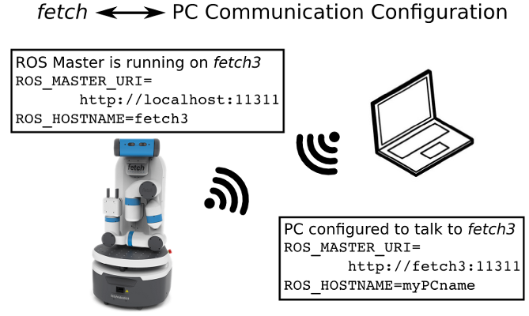

Computer Overview and Configuration
===================================

Both Fetch and Freight have an internal computer which runs a
Long Term Support (LTS) release of Ubuntu and an LTS release of
ROS. These releases are intended to give long-term stability to
the system.

.. embed-user-accounts-start

Default User Account
--------------------

Each robot ships with a default user account, with username `fetch` and
password `robotics`. It is recommended to change the password when
setting up the robot.

Creating User Accounts
----------------------

It is recommended that each user create their own account on the robot, especially
when developing from source. To create an account on the robot, ssh into the
robot as the `fetch` user, and run the following commands:

::

    >$ sudo adduser USERNAME
    >$ sudo usermod -G adm,cdrom,sudo,dip,plugdev,lpadmin,sambashare USERNAME

.. embed-user-accounts-end

Networking
----------

The robot has both internal and external Ethernet-based networks,
as well as an external wireless network interface. The external
network interfaces are intended for users to connect to the robot,
while the internal networks are used to send data between the
internal components of the robot.

The majority of communication between components onboard Fetch and
Freight happen via the internal Ethernet network. This network
is located in the 10.42.42.0/24 subnet and connects the robot
computer to the devices listed in the table below. As such,
it is important that your building networks do not use the
same subnet.

====================== =============
Device                 IP Address
====================== =============
Computer eth1          10.42.42.1
Laser range finder     10.42.42.10
Mainboard              10.42.42.42
Gripper                10.42.42.43
====================== =============

There are two possible interfaces for external connecting to the robot
computer: the wireless interface and the wired interface. Most users
will prefer to use the wireless interface, however the access panel
also includes a Gigabit Ethernet interface for stationary tasks that
require higher bandwidth.

.. warning::

    Never drive the robot with an Ethernet cable attached to the access panel.

Connecting the Robot to a Wireless Network
~~~~~~~~~~~~~~~~~~~~~~~~~~~~~~~~~~~~~~~~~~
The easiest way to configure the wireless networking is to connect a monitor,
keyboard, and mouse and use Ubuntu's Network Manager interface.

Configuring the Robot to use a Static IP for Access Panel Ethernet
~~~~~~~~~~~~~~~~~~~~~~~~~~~~~~~~~~~~~~~~~~~~~~~~~~~~~~~~~~~~~~~~~~
For 14.04: Edit and uncomment the section for eth0 in ``/etc/network/interfaces``

For 18.04: Edit and uncomment the section for eth0 in ``/etc/netplan/99-fetch``

After making changes, restarting the robot will ensure changes for the ethernet
port take effect.

Troubleshooting ROS Interactions with Robot Across a Network
~~~~~~~~~~~~~~~~~~~~~~~~~~~~~~~~~~~~~~~~~~~~~~~~~~~~~~~~~~~~
External networking with the robot is typically done to provide
an interface to various ROS capabilities. To ensure a working network setup
between robot and PC, reference the following guide to the ROS_MASTER_URI
and ROS_HOSTNAME environment variables. A key recommendation is to use hostnames
instead of IP addresses for ROS_MASTER_URI and ROS_HOSTNAME. This will minimize
issues with e.g. DHCP not being present or unexpectedly changing network behavior.

Note that the ROS_HOSTNAME is unneeded in the case where the robot and
computer hostnames are addressable on the local network. (E.g. via DNS
or entries in the file ``/etc/hosts``)

A symptom of an incomplete setup may be that some ROS commands work, while others
do not. Commands (such as ``rostopic list``, ``rosservice list``) retrieve
information through the connection they create,
while other commands (``rostopic echo``, many components in ``rviz``) attempt
to tell the robot a location to send info to via future connections.

For a more in-depth general overview of robot-to-PC networking, see also the
`ROS Network Setup Tutorial <http://wiki.ros.org/ROS/NetworkSetup>`_.

Clock Synchronization
---------------------

It is recommended to install the chrony NTP client on both robots and desktops
in order to keep their time synchronized. By default, robots do ship with chrony
installed, but did not initially. To install chrony in Ubuntu on an older robot:

::

    > sudo apt-get update
    > sudo apt-get install chrony

.. _upstart_services:

Upstart Services
----------------

Fetch and Freight use upstart to start and manage various services on the robot.
The following upstart services start when the robot is booted:

=========== ===========================================
Name        Description
=========== ===========================================
roscore     starts a roscore
robot       starts robot drivers, requires roscore
sixad       driver for robot joystick over bluetooth
soundplay   starts the sound_play node for audio in ROS
=========== ===========================================

Upstart service can be restart with the `service` command. For instance, to
restart the robot drivers:

::

    >sudo service robot stop
    >sudo service robot start

Since the roscore runs independently of the drivers, the drivers can be
restarted without having to restart remote instances of RVIZ or similar ROS
tools. Note that this also means the parameter server will not be reset
when restarting the drivers, and so a roscore restart may be required
if the parameter server has been corrupted by a user script.

Log Files
---------

A number of log files are created on the robot. Log files related to upstart
services can be found in the /var/log/upstart folder, the name of the log
will be service.log.

ROS logs for the robot and roscore upstart services will be created in the
/var/log/ros folder.

Speakers and Audio
------------------

The mainboard of Fetch and Freight contains a USB audio device.
While the device enumerates as a standard Linux audio device, we recommend
using the `sound_play ROS package <http://wiki.ros.org/sound_play>`_ to
access the speakers. ``sound_play`` is automatically started as
an :ref:`upstart service<upstart_services>` when the robot starts.
This service is pre-configured to have the correct group-level access
to the audio system. If using the speakers directly through a Linux
interface, be sure to add your user to the ``audio`` group in order
to actually access the speakers.

While the ``sound_play`` ROS interface allows users to set an audio
level, the audio level set is a percentage of the audio level set
for Linux. To adjust the Linux audio level, use the following command
and follow the on-screen instructions:

::

    >$ sudo su ros -c "alsamixer -c 1"
