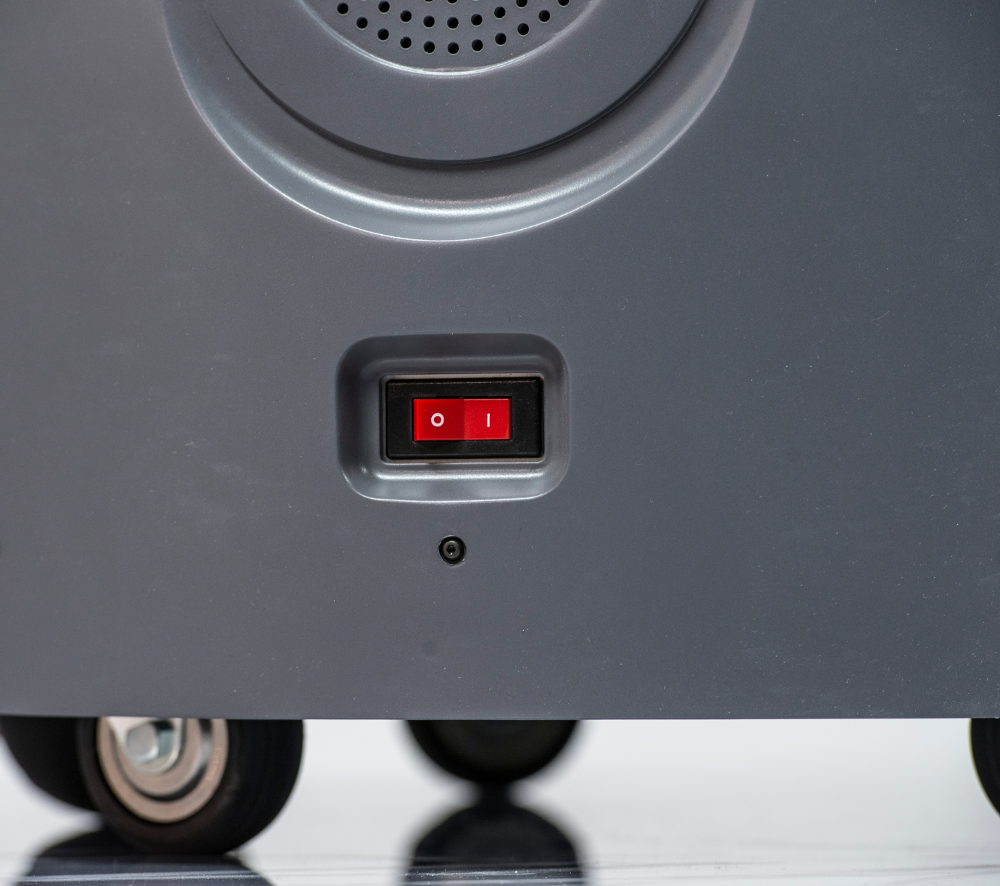
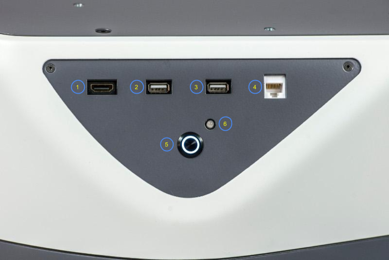

Electrical Overview
-------------------

Internally, Fetch and Freight have a number of circuit boards,
communication buses, and other components which
handle power distribution and motion control. The system
comprises:

 * The robot computer, running ROS, sends commands to the mainboard
   and gripper board over an Ethernet interface. This same Ethernet
   interface is used to communicate with the scanning laser range
   finder in the base of the robot. The ``fetch_drivers`` package
   provides an interface from the robot computer to the mainboard,
   and the default gripper.

\

 * The mainboard then communicates with the various motor controller
   boards (MCB) located throughout the robot. Communication with the
   MCBs is done over several half-duplex RS-485 buses. In addition
   to communications-related tasks, the mainboard also controls a
   number of electronic circuit breakers and also carries the charger
   circuitry which charges the batteries.

\

 * Each joint has a dedicated MCB with a dedicated microcontroller
   and an RS-485 connection. The arm MCBs all share one bus while
   all other MCBs share the other RS-485 bus. The microcontroller on
   each MCB is where the real-time control loops run.

Fetch and Freight both have two 12V Sealed Lead Acid (SLA) batteries located
in the robot base. The batteries are connected in series, providing the nominal
24V power rail for the robot. These batteries are kept charged by the mainboard (see
:ref:`charging`).

.. _breakers:

Breakers
++++++++

There are several breakers within the robot. These are designed in order to prevent
damage to the robot if cabling should become worn or shorted out, or in the case
of sudden, unexpected overload of a joint. The table below describes each breaker,
using the names that are used in ``fetch_drivers`` and diagnostics:

================ ========================================================
Breaker Name     Usage
================ ========================================================
supply_breaker   Limits current between the charging inlet and mainboard.
battery_breaker  Limits current between the mainboard and batteries.
computer_breaker Limits current delivered to the robot computer.
base_breaker     Limits current delivered to base MCBs, as well as torso
                 and head MCBs on Fetch.
arm_breaker      Limits current delivered to the MCBs located in the arm
gripper_breaker  Limits current delivered to the gripper.
================ ========================================================

When a breaker is disabled or tripped, power will no longer flow to the connected
devices. In the case of MCBs, this means that they will not be able to communicate
with the mainboard.

.. _power_disconnect:

Power Disconnect Switch
+++++++++++++++++++++++

The power disconnect is on the lower back of the robot. This switch
cuts the power between the battery and the mainboard. It also acts as
a breaker, limiting the total current that can be delivered by the
batteries.

Runstop
+++++++

The runstop is used to stop all operation of the joints. It works by disabling
the base, arm and gripper breakers. When the runstop is pressed, the drivers
will not be able to communicate with the MCBs, and thus their position and
other data will not update in RVIZ nor the runtime monitor.

.. _access_panel:

Access Panel
++++++++++++

Fetch and Freight both have an access panel with 2 USB, an Ethernet, and an
HD Video port. All of these ports are connected directly to the onboard
computer. In addition, Fetch has an extra USB port on the head.

====== =========================
Item # Item Name                
====== =========================
 1     HD Video Port       
 2     USB Port 1
 3     USB Port 2
 4     Ethernet Port
 5     Power Button
 6     Charge Indicator Light
====== =========================

The access panel is also the location of the power button which turns
the robot on or off. This switch is connected to the mainboard and
will only work if the power disconnect switch (the red one on the
lower back of the robot) is in the ON position. Pressing the power
button until it lights up with boot the robot, including the computer.
To turn the robot off, press and hold the illuminated power button on
the access panel until it starts blinking. The button will continue
blinking until the computer has successfully shut down, and then power
will be disconnected.
