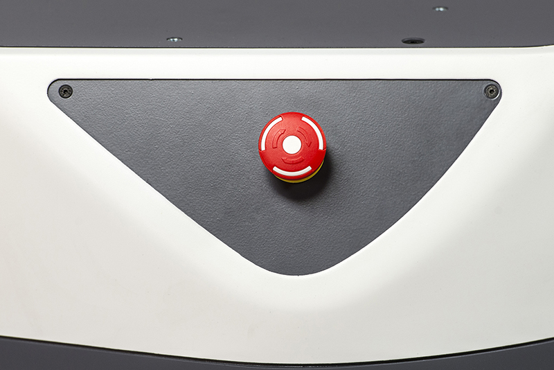

Frequently Asked Questions
==========================

How can I cite Fetch or Freight in an Academic Paper?
-----------------------------------------------------

We recommend citing our `workshop paper on Fetch & Freight <http://docs.fetchrobotics.com/FetchAndFreight2016.pdf>`_:

::

   Fetch & Freight: Standard Platforms for Service Robot Applications
   Melonee Wise, Michael Ferguson, Derek King, Eric Diehr and David Dymesich
   Workshop on Autonomous Mobile Service Robots, held at the
   2016 International Joint Conference on Artificial Intelligence, NYC, July 2016

How do I create a good support ticket?
--------------------------------------
* Go to the `Fetch Support Website <http://support.fetchrobotics.com:8080/>`_ and log in using your username and password

* Make sure the robot is not runstopped and then run the following commands on your local computer (Not the robot!)

::

   sudo apt update && sudo apt install ros-melodic-fetch-tools
   declare -x ROS_MASTER_URI="http://*RobotHostNameGoesHere*:11311"
   fetch debug-snapshot

.. note::

   You will need ros-melodic-fetch-tools version 0.1.2 or greater to use the debug-snapshot command

* Create a new support ticket and attach the zip file that was created

* Clearly state problem you are having in the ticket so we can better serve you

Why won't my robot do anything at all (charge, move, etc...)?
-------------------------------------------------------------
* Verify the red "breaker switch" on the back of the robot below the air vents is in the "ON" position

.. figure:: _static/power_disconnect.png
   :width: 50%
   :align: center
   :figclass: align-centered

* If this did not solve your problem please contact Fetch Support

Why won't my robot turn on when I push the power button?
--------------------------------------------------------

* If the charging light (#6 in figure below) is red Please try Charging the robot

.. figure:: _static/access_panel_numbered.png
   :width: 50%
   :align: center
   :figclass: align-centered

* If this did not solve your problem please contact Fetch Support

Why won't my robot move when I use my PS3/PS4 joystick?
-------------------------------------------------------

* If ring around the on button (#5 in figure below) is not illuminated please press the power button to turn on your robot (give it some time to boot and then try again)

.. figure:: _static/access_panel_numbered.png
   :width: 50%
   :align: center
   :figclass: align-centered

* PS4 controller: If the LED on the front of the controller is not solid blue, then the controller
  is not connected. Press the middle PS4 button to connect.

  * If the PS4 controller won't connect, you can try re-pairing it. :doc:`See these instructions </ps4>`.

* PS3 controller: If there are no red lights illuminated on the front of the PS3 controller then press the round button in the center of the controller to turn on the controller (when it is ready to use it will vibrate) (Red lights will be in one of the 4 holes to the left of the charging port in the following picture.)

.. figure:: _static/joystick_numbered2.png
   :width: 50%
   :align: center
   :figclass: align-centered

* Please verify that the runstop (seen below) has not been pressed.

   - If it is pressed twist it to turn it off

* If this did not solve your problem please contact Fetch Support

The robot will not move and/or slows down near obstacles, why?
--------------------------------------------------------------

* Please be aware, The robot's max speed is reduced when the laser sees an object directly in front of it. Despite this reduction the robot will always be able to travel at least 0.1 m/s even when the robot is almost touching an obstacle so it can not get locked down. This behavior is at the driver level.

* If you are autonomously navigating and the robot stops completely you should check your costmap and/or navigation algorithms

* If you are using the controller, it is on/connected and the robot stops please contact Fetch Support

I just sent a trajectory command to the arm and now it won't gravity compensate, help?
--------------------------------------------------------------------------------------
* Please verify that the trajectory command you sent to the arm was smoothed and doesn't exceed the velocity/acceleration limits of the arm. Otherwise when the arm exceeds its limits a breaker will trip cutting power to the arm

   - To reset the breakers please follow this guide (:ref:`resetting_breakers`)

* If this did not solve your problem please contact Fetch Support
