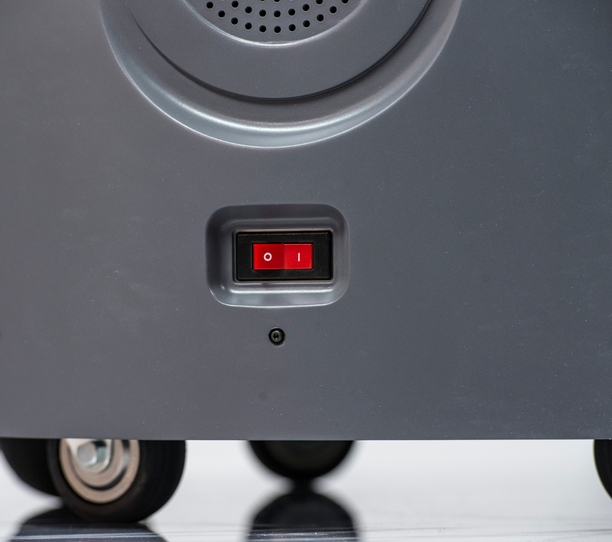

Frequently Asked Questions
==========================

Why won't my robot do anything at all (charge, move, etc...)?
-------------------------------------------------------------
* Verify the red "breaker switch" on the back of the robot below the air vents is in the "ON" position

* If this did not solve your problem please contact Fetch Support

Why won't my robot turn on when I push the power button?
--------------------------------------------------------

* If the charging light (#6 in figure below) is red Please try Charging the robot
.. figure:: _static/access_panel_numbered.png
   :width: 50%
   :align: center
   :figclass: align-centered

* If this did not solve your problem please contact Fetch Support

Why won't my robot move when I use my PS3 joystick?
------------------------------------------------------

* If ring around the on button (#5 in figure below) is not illuminated please press the power button to turn on your robot (give it some time to boot and then try again)
.. figure:: _static/access_panel_numbered.png
   :width: 50%
   :align: center
   :figclass: align-centered

* If there are no red lights illuminated on the front of the ps3 controller then press the round button in the center of the controller to turn on the controller (when it is ready to use it will vibrate) (Red lights will be in one of the 4 holes to the left of the charging port in the following picture.)
.. figure:: _static/joystick_numbered2.png
   :width: 50%
   :align: center
   :figclass: align-centered
* Please verify that the runstop (seen below) has not been pressed.
 - If it is pressed twist it to turn it off
.. figure:: _static/runstop_panel.png
   :width: 50%
   :align: center
   :figclass: align-centered
* If this did not solve your problem please contact Fetch Support

I just sent a trajectory command to the arm and now it won't gravity compensate, help?
--------------------------------------------------------------------------------------
* Please verify that the trajectory command you sent to the arm was smoothed and doesn't exceed the velocity/acceleration limits of the arm. Otherwise when the arm exceeds its limits a breaker will trip cutting power to the arm
 - To reset the breakers please follow this guide (:ref:`resetting_breakers`)
* If this did not solve your problem please contact Fetch Support
