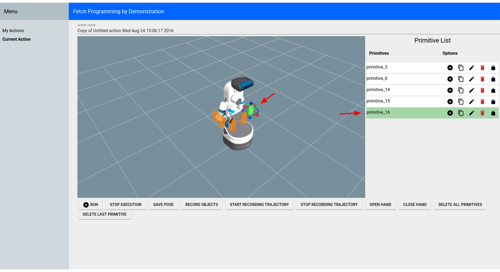
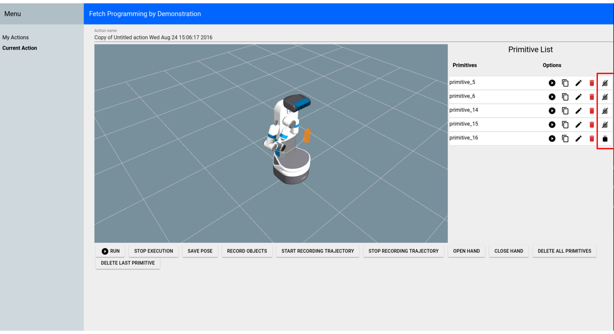
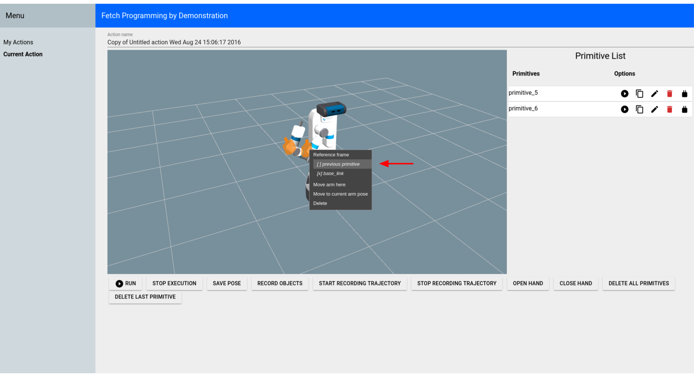

Tutorial: Fetch Programming by Demonstration
============================================

The `fetch_pbd <https://github.com/fetchrobotics/fetch_pbd>`_ package is based on PR2 Programming by Demonstration. This version is for Fetch. It will not work on Freight because Freight does not have an arm.

The original `PR2 Programming by Demonstration <https://github.com/PR2/pr2_pbd>`_ was done by `Maya Cakmak <http://www.mayacakmak.com/>`_ and the `Human-Centered Robotics Lab <https://hcrlab.cs.washington.edu>`_ at the University of Washington.

System Requirements
-------------------
This PbD is designed for Ubuntu 14.04 and ROS Indigo.

Installing from Source
----------------------

Clone the repository and build on the robot:

::

    >$ cd ~/catkin_ws/src
    >$ git clone https://github.com/fetchrobotics/fetch_pbd.git
    >$ cd ~/catkin_ws
    >$ catkin_make

Running
-------

Run these commands on a terminal on the Fetch:

::

    >$ source ~/catkin_ws/devel/setup.bash
    >$ roslaunch fetch_pbd_interaction pbd.launch

You can run the backend without the "social gaze" head movements or without the sounds by passing arguments to the launch file:

::

    >$ source ~/catkin_ws/devel/setup.bash
    >$ roslaunch fetch_pbd_interaction pbd.launch social_gaze:=false play_sound:=false

You can also pass arguments to the launch file to save your actions to a json file or load them from a json file.
This behaviour is a bit complicated. It is recommended that you specify the full path to files or else it will look in your .ros folder.
If you specify a from_file then actions will be loaded from that file. They will replace the ones in your session database.
Whatever was in your session database will get stored in a timestamped file in your .ros folder (not overwritten).
If you specify a to_file then whatever is in your current session file be saved to that file.

::

    >$ source ~/catkin_ws/devel/setup.bash
    >$ roslaunch fetch_pbd_interaction pbd.launch from_file:=/full/path/from.json to_file:=/full/path/to.json

Using the GUI
-------------

In your browser go to ROBOT_HOSTNAME:8080 in your browser to use the GUI. This can be used on mobile as well. The mobile version does not show the visualizer, but can be useful for saving/deleting

The main page lists all the available actions.

.. figure:: _static/fetch_pbd_home_screen.png
   :width: 100%
   :align: center
   :figclass: align-centered

You can directly run/copy/delete actions from the main page. Or hit the "Edit" button to see more information on that action.

On the "Current Action" screen, most of the buttons are pretty self-explanatory. You can execute the entire action using the "Run" button at the bottom of the screen. This will execute all of the primitives in the order they appear in the Primitive List. You can click on a specific primitive (either the marker or the list item), to highlight the primitive.

You can show/hide the markers for each primitive by clicking the marker icon for the primitive in the Primitive List.

You can change the order of the primitives by dragging them to a new position in the list.

.. figure:: _static/fetch_pbd_reorder.png
   :width: 100%
   :align: center
   :figclass: align-centered

You can edit the position and orientation of certain primitives by clicking the edit icon or by moving the interactive marker.

.. figure:: _static/fetch_pbd_edit.png
   :width: 100%
   :align: center
   :figclass: align-centered

You can change the frame that certain primitives are relative to by right-clicking the marker.

You can also change the name of the action.

.. figure:: _static/fetch_pbd_rename.png
   :width: 100%
   :align: center
   :figclass: align-centered

Code Interface
--------------

You can also access the actions you've programmed through code. You still need to run pbd_backend.launch.

::

    >$ source ~/catkin_ws/devel/setup.bash
    >$ rosrun fetch_pbd_interaction demo.py

System Overview
---------------

**Interaction Node:**
The pbd_interaction_node.py handles the interaction between speech/GUI and the rest of the system. Changes happen through the update loop in interaction.py and also through the callbacks from speech/GUI commands. interaction.py also subscribes to updates from the pbd_world_node.py, which notifies it of changes in objects in the world. Through callbacks and the update loop, interaction.py hooks in to session.py. session.py handles creating actions and primitives and saving them to the database.

**Arm Control Node:**
The pbd_arm_control_node.py is how the robot's arm is controlled to execute actions/primitives. It provides a lower level service interface to move the arm. The interaction node interacts with this through the interface in robot.py.

**World Node:**
The pbd_world_node.py handles the robot's perception of the world. Other nodes ask the world node about the state of the world and can both send and subscribe to updates to the world. Its main function is to provide a list of objects currently in the scene.

**Social Gaze Node:**
The social_gaze_server.py handles the movements of the robot's head. This is also controlled through the robot.py interface. The sounds are also provided through this interface.
