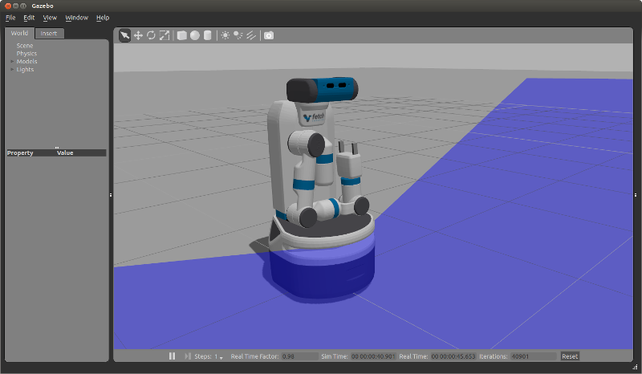

Tutorial: Gazebo Simulation
===========================

Starting the Simulator
----------------------
The ``fetch_gazebo`` package includes several launch files:

 * simulation.launch spawns a robot in an empty world.
 * playground.launch spawns a robot inside a lab-like test environment.
   This environment has some tables with items that may be picked up
   and manipulated. It also has a pre-made map which can be used to
   test out robot navigation and some simple demonstrations of object
   grasping.

To start the simplest environment:

::

    >$ roslaunch fetch_gazebo simulation.launch

Note that all of the environments will prepare the robot by tucking the
arm and giving the head an initial command.

Visualizing with RVIZ
---------------------
Even though Gazebo has a graphical visualization, RVIZ is still the preferred
tool for interacting with your robot.

::

    >$ rosrun rviz rviz

.. todo:: ADD IMAGE OF RVIZ

You can now `manually set up your RVIZ visualization 
<http://gazebosim.org/tutorials?tut=drcsim_visualization&cat=drcsim#VisualizingtheRobotmodel>`_
or re-run RVIZ with a configuration file using the command line.

The default ``.rviz`` configuration file for Fetch can be loaded using:

::

	>$ roscd fetch_navigation/config
	>$ rviz navigation.rviz

.. todo:: ADD IMAGE OF DEFAULT CONFIG

.. _mm_demo:

Running the Mobile Manipulation Demo
------------------------------------

There is a fully integrated demo showing navigation, perception
and MoveIt! working together on the robot in simulation. To run the
demo, start Gazebo simulator with the playground:

::

    >$ roslaunch fetch_gazebo playground.launch

Wait until the simulator is fully running and then run the demo
launch file:

::

    >$ roslaunch fetch_gazebo demo.launch

This will start:

 * navigation.launch - this is the navigation stack with a pre-built map of
   the environment.
 * move_group.launch - this is the MoveIt configuration which can plan for
   the movement of the arm.
 * basic_grasping_perception - this is a simple demo found in the
   ``simple_grasping`` package which segments objects on tables and computes
   grasps for them.
 * demo.py - this our specific demo which navigates the robot from the
   starting pose in Gazebo to the table, raises the torso, lowers the head
   to look at the table, and then runs perception to generate a goal for
   MoveIt. The arm will then grasp the cube on the table, tuck the arm and
   lower the torso. Once the robot is back in this tucked configuration,
   the navigation stack will be once again called to navigate into the room
   with the countertop where the robot will place the cube on the other
   table.

Simulation vs. Real Robots
--------------------------
The simulated robot may not be identical to the real robot. In fact, the
real robot is likely quite a bit better behaved. Also:

 * The simulator does include the IMU. Therefore, there is also no
   base odometry fusion with IMU data, and the base_controller publishes
   all required TF data directly.
 * The simulated robot arm is not as well tuned as the real robot. The real
   arm will not wobble the way the simulated arm does when executing a
   trajectory. The simulated robot has also not been tuned with various
   payloads. It is best used for examining the workspace of the robot,
   and not the actual controls-related performance of the arm.
 * The fingers of the real robot gripper are driven by the same leadscrew,
   so the object will always be grasped in the center of the gripper. With
   the simulated robot, the fingers are independently actuated, and so the
   object may drift to one side.
 * Currently, the simulator package does not include a multiplexor for the
   cmd_vel topic. The real robot will certainly include a multiplexor that
   allows the joystick teleop to override the commands sent to cmd_vel.
