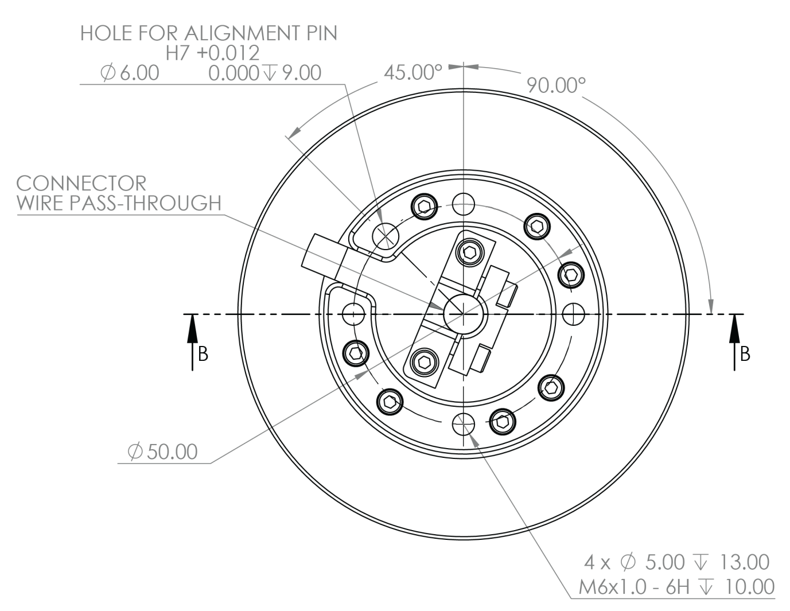
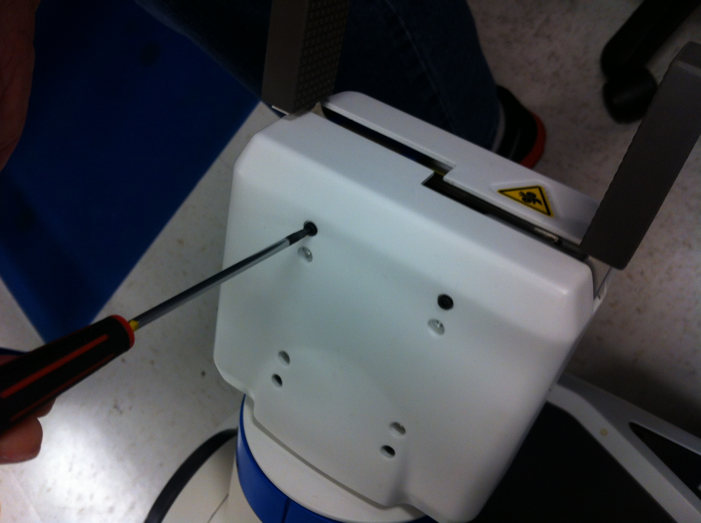
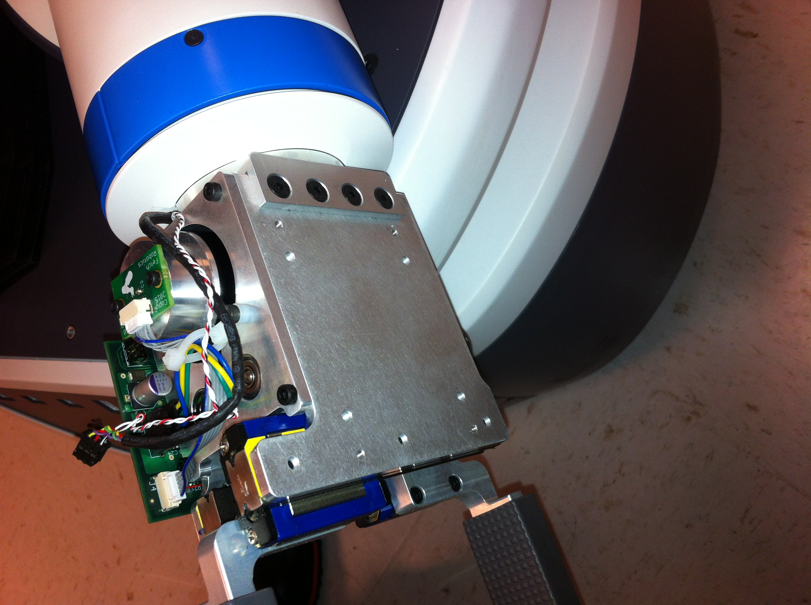
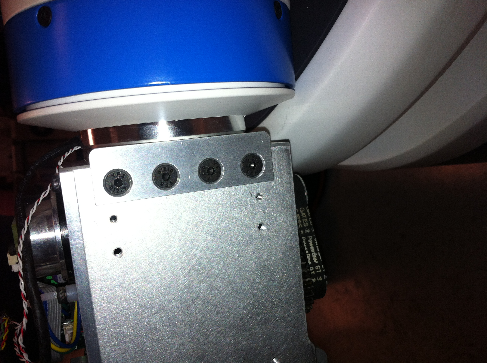

Tutorial: Interfacing Third Party Grippers with Fetch’s Arm
===========================================================

Fetch offers a modular mobile manipulator platform, capable of
completing a variety of tasks across complex environments. End-effector
mechanisms such as grippers are the physical basis for how a robot
interacts with the world. Grippers offer different utility based on
their governing kinematic design allowing a robot to achieve a desired
task. The Fetch gripper is a parallel pincher which offers a wide range
of utility, however, there may be instances where a different
configuration is desirable. The following tutorial outlines the
procedure for interfacing different robot grippers creating a procedural
approach for doing this using Fetch’s mechanical, electrical, and
software interfaces. After a review of systems two specific examples are
presented.

Mechanical Gripper Interface of Fetch:
--------------------------------------

The gripper flange has four M6x1.0 thread holes for attaching a gripper
to the robot. The holes are spaced equally around a 50 mm diameter
circle. The bolts should be tightened to 8 N·m, making sure there is 8
to 10 mm of threads engaged. For rotational alignment, an optional 6 mm
diameter hole is provided for an alignment pin. For accurate centering
of mounted tools, the gripper flange’s 6.5 mm high, 63 mm diameter boss
can be factored into the tool design. A cable path is provided for
optional cable routing.

Electrical Gripper Interface of Fetch
-------------------------------------

Fetch's main electronic board provides a current limited breaker that
can supply up to 50 Watts of power at 24 Volts. The gripper breaker can
be enable and disable through service calls. Fetch’s Gripper Connector
is 6 pin Hirose; Part Number DF11-6DS-2C. Carrying both power and
ethernet on the same harness. The proper mating connector housing is a
Hirose DF11-6DEP-2C. Modifications can be made to current and voltage
requirements to facilitate power changes for an adapted gripper as long
as the current running through the internal robot harness does not
exceed 2 Amps.

At the robot's base an RJ45 plug contains four wire signals that can be
accessed at the gripper connector. See Tables below for pin assignment.

.. raw:: html

   

+----------------------+---------+---------+
| Parameter            | Value   | Unit    |
+======================+=========+=========+
| Supply Voltage       | 24      | Volt    |
+----------------------+---------+---------+
| Max Rated Current    | 2       | Amps    |
+----------------------+---------+---------+
| Supply Capacitance   | 450     | µf      |
+----------------------+---------+---------+
| Max Power            | 96      | Watts   |
+----------------------+---------+---------+

.. raw:: html

   

.. raw:: html

   

+-------+----------+
| Pin   | Signal   |
+=======+==========+
| 1     | GND      |
+-------+----------+
| 2     | +24V     |
+-------+----------+
| 3     | TX+      |
+-------+----------+
| 4     | RX+      |
+-------+----------+
| 5     | TX-      |
+-------+----------+
| 6     | RX-      |
+-------+----------+

.. raw:: html

   

Software Gripper Interface of Fetch
-----------------------------------

For interfacing a gripper with the existing fetch software, there are
five components which form the architecture. They are: the robot unified
description format, the gripper controller, the gripper driver, config
files, and Moveit setup.

For interfacing a gripper with the existing fetch software, there are
five components which form the architecture. They are: the robot unified
description format, the gripper controller, the gripper driver, config
files, and Moveit setup.

**Robot Description Format:** The first step in interfacing the gripper
would be to modify the fetch urdf and mount the third party gripper.
This will be used in both simulating the grasps and also to check for
collisions. One aspect to note is that many grippers utilize mechanisms
which form closed kinematic chains, which present challenges while
implementing in URDF, because URDf parses and stores the model in a tree
structure. Many packages in ROS such as TF and Moveit! rely on the URDF.
To utilize these simplify the model into an open chain.

**Gripper Controller:** The fetch by default uses the parallel gripper
controller from the robot controllers package which is a robot control
infrastructure, developed initially for Fetch and Freight, but designed
to be robot-agnostic. Alternatively gripper specific controllers can be
used, which can be provided by the gripper manufacturers. Gripper
controllers are mainly used for simulation with gazebo.

**Gripper Drivers:** Gripper drivers for different grippers could be
obtained from the gripper manufacturer. The gripper drivers communicate
to the gripper at a lower level, to control the gripper. In order to use
a gripper, the drivers must be installed.

**Config Files:** Specify the configuration of the systems used for the
robot. In order to interface a new gripper these can be augmented.

**Moveit!:** After initial setup after URDF augmentation, a new set of
self collision matrices must be generated. Moveit! setup assistant can
be used to generate a new Fetch Moveit Config.

Outline of Interfacing Grippers with Fetch
------------------------------------------

Later in this tutorial two examples will be presented, however, a
general procedure outline can be identified. To integrate various
grippers with the Fetch platform.

1. Identify gripper communication protocol.
2. Test gripper first as a stand alone using computer.
3. Testing functionality.
4. Remove existing gripper.
5. Make a connector. So it interfaces with the gripper and the fetch
   system.
6. Augment the URDF to include new gripper.

-  Note: our robot controller is a parallel gripper robot controller. If
   the gripper is not of this type of method is to simplify the URDF
   such as open chain with two prismatic fingers. Set up robot
   controllers.

7. Generate move it config and collision matrix.

Removing the Fetch Gripper
--------------------------

Before removing the gripper, make sure that the robot is switched off by
pressing and holding down the power button until the light blinks and
turns off.

Make sure that the arm is placed in a safe position and also make sure
that the arm is away from any potential liquid exposure.

To remove the fetch gripper, first the outer skin has to be removed by
taking out four M2.5x6 screws on either side of the gripper.

Once all the eight screws are removed from the outer skin of the
gripper, then the skin comes off.

Next, disconnect the power/communications cable from the gripper control
board.

This is done by disconnecting the black wire which comes from the base
of the gripper and it connects to the gripper control board.

Next, remove the four M3 x 8mm screws from the gripper adapter on either
sides of the adapter.

This would completely disconnect the gripper module from the arm.

Now, the gripper adapter can be removed by taking out the four M6 x 14mm
screws at the base of the griper adapter.

Different grippers can be mounted on the arm by using the standard ISO
mount.

Fetch Moveit Config
-------------------

The fetch moveit config contains the srdf file which contains the self
collision matrix. A new set of fetch moveit config can be generated by
using the Moveit setup assistant.

Moveit setup assistant can be downloaded from the following link

Note: There is an extra controllers.yaml file in the default
fetch_moveit config. This file should be modified and included in the
newly generated fetch\_moveit\_config

The gripper action server for robotiq uses GripperCommand messages to
the gripper_controller action_ns.

However the barrett hand ros package does not use an action server. And
so the Barrett Hand can be controlled by sending
"sensor_msgs/JointState" to the topic /bhand_node/command

.. include:: robotiq_gripper.rst
.. include:: barrett_hand.rst
