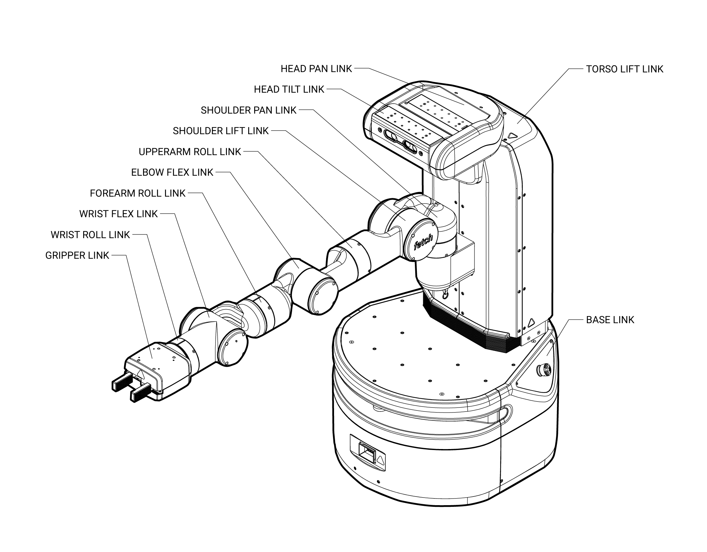
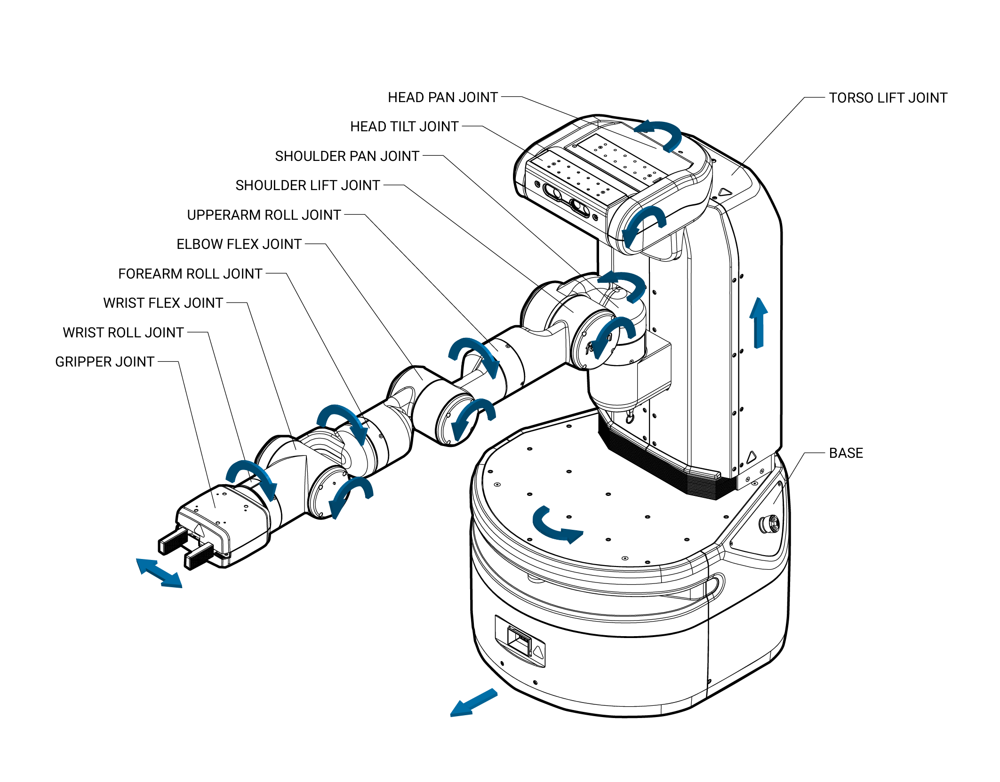

Mechanism Terminology
---------------------

The Fetch and Freight kinematics are defined by using the concepts of
joints, links, and coordinate frames. The robot URDF (unified robot
description format) model specifies the attributes (kinematic tree,
names, ranges, etc.) of the joints, links, and frames of the robot. A
link element in the URDF describes a rigid body with inertia, visual
features, and coordinate frames. A joint element in the URDF defines
the kinematics, dynamics, safety limits, and type (revolute,
continuous fixed, prismatic, floating, or planar). Fixed joints are
typically used to describe the relationship between two rigidly joined
components in the robot.

Link 
++++ 

The links for the Fetch and Freight are defined in the URDF description
that are located in the fetch_description or freight_description
package respectively. 

Frame
+++++

Frames represent the coordinate frames of links, detected objects,
sensors, or the location of another robot in the world. Frames are
define relative to other frames and the transformations between each
frame is tracked using TF. 

Joint
+++++

A joints define the relationship between links and are defined in the
URDF description that can be found in the fetch_description or
freight_description package respectively. In the Fetch and Freight the
majority of the joints are rotational, the torso is prismatic, and
there are several fixed joints describing the location of sensors
within the robot. Rotational and translational joints are represented
similarly in the URDF, and joint forces are described as *effort*
instead of force or torque. Position, and velocity are both used to
describe linear and angular motion of a joint.

Fetch Home Pose
+++++++++++++++

The home pose of the Fetch robot is used to describe the joint
positions in a consistent manner. The home pose is defined as the
robot arm straight out in front of the robot with all x-axes aligned,
the gripper in the closed position, and the x-axes of the head
parallel and aligned with the arm, in this position all of the joints
are considered to be zeroed. The calibration reference for most joints
are not at the joint zero and the URDF of the Fetch contains the
offsets for each joint.

Coordinate System
+++++++++++++++++

The coordinate frames for all links in the Fetch and Freight are defined
with positive z-axis up, positive x-axis forward, and positive y-axis
to the robot-left when Fetch is in the home pose. All joint angle
conventions are chosen such that from the home pose, positive motion
of the joint results in positive motion around a positive axis of a
joint coordinate frame (i.e. right handed).

Naming Conventions
++++++++++++++++++

In general, the names for a link, a joint, and frame will be similar
(e.g. shoulder_pan_link, shoulder_pan_joint, and
shoulder_pan_frame). Short prefixes are used to describe the location
of repeated components (i.e. drive wheels). The diagrams below show
the link and joint naming conventions as well as the positive
direction of joint motion.

