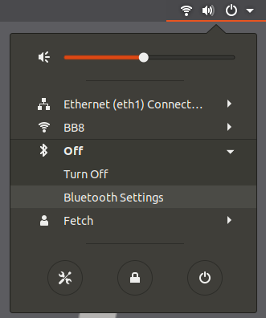
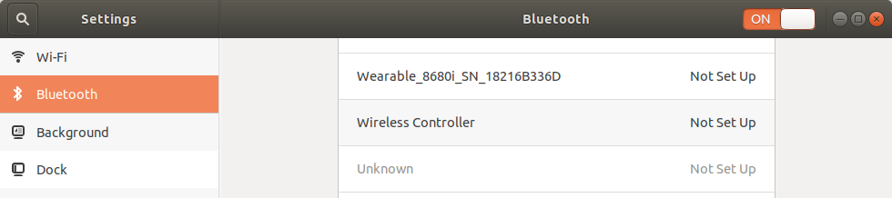
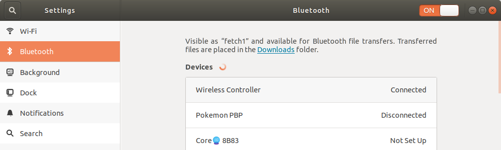

Switching your robot to using a PS4 controller
==============================================

This procedure guides you in updating your robot to be controlled
with a PS4 controller.

*Who is this guide intended for?:*

- Customers who received a PS3 controller with their robot, and would like to instead use
  a PS4 controller with their robot.

*What requirements are there for using a PS4 controller?:*

- Your robot needs to be running Ubuntu 18.04 + ROS Melodic
- You will need a PS4 controller (also called *DualShock 4 Wireless Controller
  for PlayStation 4*).

.. warning:: Third party controllers may not work. Only Sony PS4 controllers have been tested.

Upgrade your Fetch robot's packages
-----------------------------------
Run the following to upgrade packages that are relevant::

  sudo apt update
  sudo apt install --only-upgrade ros-melodic-*

  export ROBOTTYPE=$(hostname | awk -F'[0-9]' '{print $1}')
  wget http://packages.fetchrobotics.com/binaries/$ROBOTTYPE-melodic-config.deb
  sudo apt install ./$ROBOTTYPE-melodic-config.deb -y

Disable the PS3's ps3joy driver/service
---------------------------------------

The following commands will disable the ps3joy systemd service::

  sudo service ps3joy stop
  sudo systemctl disable ps3joy

Restart Bluetooth and Pair PS4 Controller
-----------------------------------------

Since ps3joy disables the default Bluetooth service, the following is needed to start
it again::

  sudo service bluetooth restart

Next, a monitor needs to be hooked up to the robot, in order to go through the Bluetooth
pairing process.

To pair with the controller, open the wifi menu in the top right, expand the Bluetooth
section, and click the Bluetooth settings, indicated below:

To put the controller in pairing mode, press and hold the Share button, and then press
and hold the center PS4 button for a second and then release it, and then release the
share button.  The LED on the controller should start flashing twice, once per second.

If the LED is flashing once per second, you may need to retry the above after turning off the
controller.  You can turn off the controller by holding the center button for 10s.

Once the controller is in pairing mode, it should show up in the list of devices, like
below.  You may have to scroll to the bottom of the list.

Once you click the Wireless Controller entry, it should show up as connected at the top
of the list.

When the controller is connected, its LED will be solid blue.

Next, disconnect the controller.
To disconnect the controller, you can hold the central button for 10 seconds.
To re-connect the controller, just pressing the center button is required.  Sometimes
it may take a couple tries.

Enable the ds4drv driver/service for the PS4 controller
-------------------------------------------------------

Next we enable the new service (created by the updated install of fetch-melodic-config)::

  sudo systemctl daemon-reload && sudo systemctl enable ps4joy && sudo service ps4joy start

This is a custom service that launches `ds4drv <https://github.com/chrippa/ds4drv>`__.

Set the robot to use the PS4 controller
---------------------------------------

To enable the PS4 controller inputs to move the robot, a param needs to be set in
/etc/ros/melodic/robot.launch.

If your robot is using a robot.launch file that you restored after installing ROS Melodic, you
may need to make the following modification to your robot.launch file to add the ps4 param::

  - <include file="$(find freight_bringup)/launch/include/teleop.launch.xml" />
  + <include file="$(find freight_bringup)/launch/include/teleop.launch.xml">
  +   <arg name="ps4" value="true" />
  + </include>

Additionally, if you previously modified robot.launch to add the following arg, **you should remove this arg**::

  <arg name="joy_device" value="/dev/input/js0" />  # Remove this line if it exists!

By default, with the latest update, the above parameter is not needed. It now defaults to
/dev/fetch_joy, which will get created by UDEV rules for both PS3 and PS4 controllers.

Finally, with the arm safely resting so that it won't fall, restart roscore.::

    sudo service roscore restart

The controller should now move the robot.

Troubleshooting
===============

If you run into issues, check the following when the controller is connected:

- Does ``jstest /dev/ps4joy`` reflect movement of the PS4 controller when it is connected?
- What nodes are listed when you do ``rosnode list | grep joy``? We expect, joy_node and joy_remap.
- Is the topic ``/joy`` publishing? (``rostopic hz /joy``)

Reverting back to using PS3 controller
======================================

While not recommended, in case you encounter issues and need to switch back, the below
outlines the steps to revert the procedures above:

1. Change the ps4 arg value to false in /etc/ros/melodic/robot.launch
2. ``sudo service ps4joy stop && sudo systemctl disable ps4joy``
3. ``sudo systemctl enable ps3joy && sudo service ps3joy start``
4. With the arm safely resting so that it does not fall, ``sudo service roscore restart``
5. Connect your PS3 controller.
