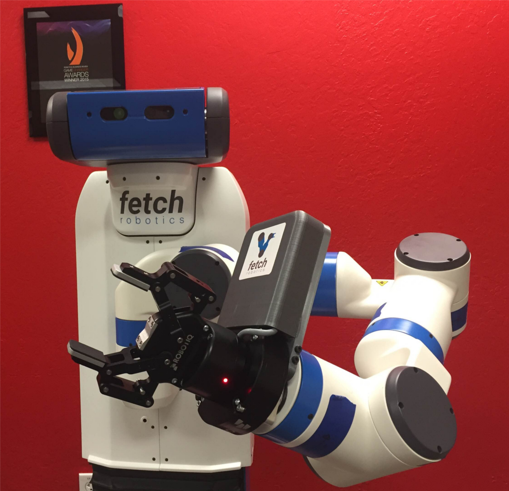

Robotiq Adaptive Robot Gripper 2-Finger 85 Fetch Integration Documentation
--------------------------------------------------------------------------

Overview
~~~~~~~~
The robotiq adaptive 85 gripper is a two finger gripper with a different
mechanism than the one in the parallel gripper in fetch.

The robotiq adaptive 85 uses a five bar closed kinematic chain mechanism
to perform its grasping.

Closed chain mechanisms like these are not supported by the URDF format
itself as it parses the data in a tree structure and a closed loop would
cause it to give out errors.This would cause significant technical
difficulties in representing the robot in an accurate manner.

There are a couple of ways in which this could be dealt with, One way is
to modify the existing mechanism, by disconnecting some joints and
making them fixed, thereby breaking the closed loop chain, however this
will restrict the motion of the gripper in certain ways.

Another way to go about it is by coming up with a prismatic setup
similar to existing gripper in fetch and cover all the possible
collision geometry of the robotiq in the gripper base link.

A similar approach could be used to similar grippers with closed loop
kinematic chains.

Next, the robot controllers have to be setup, If the default robot
controllers are used, then it is required that the two finger joints in
the URDF be named as r_gripper_finger_joint and
l_gripper_finger_joint as the default robot controllers look
specifically for these joints. And the gripper pid’s have to be tuned
according to the new gripper.

To control the actual gripper in the robot, the robotiq gripper package
has to be downloaded from https://github.com/ros-industrial/robotiq

By default the gripper is controlled by sending actionlib messages to
the gripper drivers. The robotiq package provides an action server to
control the gripper.

Here the robotiq is controlled by using the modbus RTU protocol.

Tried and tested on
~~~~~~~~~~~~~~~~~~~

Operating System : Linux Ubuntu 14.04.3 LTS

Kernel Version : 3.16.0-45-generic

Ros Driver Installation
~~~~~~~~~~~~~~~~~~~~~~~

::

    >$ mkdir -p ~/robotiq/src

    >$ cd robotiq/src

    >$ catkin_init_workspace

    >$ cd ..

    >$ catkin_make

    >$ cd src

    >$ git clone https://github.com/ros-industrial/robotiq

.. note::  The EtherCAT soem library is also required to build the Robotiq package.

To install EtherCAT soem
::

   >$ sudo apt-get install ros-indigo-soem

Now to catkin make the package and source it,
::

  >$ cd ..

  >$ catkin_make

  >$ source devel/setup.bash

Now the ROS drivers have been installed and ready to use

To launch the controller,
::

   >$ rosrun robotiq_c_model_control CModelRtuNode.py “/dev/ttyUSB0”

This will launch the controller/driver for the gripper.

.. note:: USB port name may not be the same for all the computers and so to
find the name of the usb port,

::

   >$dmesg | grep tty

This will show the recent connected devices in the USB.

To perform a simple open close control manually,

::

   >$Rosrun robotiq_c_model_control CModelSimpleController.py

this could be used to control the gripper using the keyboard.

To launch the actionserver provided by robotiq,
::

   >$roslaunch robotiq_action_server robotiq_c_model_action_server.launch
.. note:: For the robotiq action server to work with the robotiq controller, the controller topics have to be remapped to /gripper/input and /gripper/output, this could be done by launching the controller with the following arguements

::

   >rosrun robotiq_c_model_control CModelRtuNode.py “/dev/ttyUSB0” CModelRobotInput:=/gripper/input CModelRobotOutput:=/gripper/output
