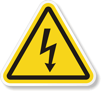
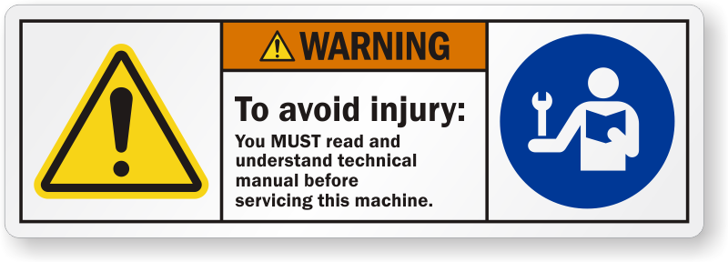

Safety
======

Safety is extremely important to Fetch Robotics. Safe operation of
robots is important yet challenging and it is important to remember
that safety is a continual process that is shared by the robot
designer, operator, and administrator. The following section provides
an overview of the issues, safety-related design features, and a basic
set of guidelines to support safety when using the Fetch and Freight
R&D robots.

Safety Overview
---------------

When operating Fetch and Freight R&D robots users should always be
conscious of safety. Remember the robots are heavy pieces of equipment
and have moving parts. As the robots travel through an environment they can
carry and manipulate a wide variety of objects. Since the Fetch &
Freight R&D robots are for applications development, their moves and
actions may not be entirely predictable. Both the Fetch and Freight
robots can cause significant damage if they fall on or run into a
person. There are also several ways that the robots can pinch, grab,
or twist fingers or other body parts (these regions are
labeled). Fetch can also manipulate dangerous objects and knock over
heavy objects. People should always be cautious and attentive around
Fetch and Freight R&D robots.

Design Features
---------------

While retaining the power of a R&D platform, both the hardware and
software of Fetch and Freight are designed to minimize risk. The
exterior of both Fetch and Freight clearly mark regions that could pinch
or injure while mechanism is in motion or being moved by hand. Both
Fetch and Freight have emergency stop buttons in case there is a need to
immediately stop the motion of the robot.

In software, low-level safety limits have been incorporated to limit
motor current, motor velocity, range of joint motion, and trajectory
deviations. High-level applications also integrate the various
on-board sensors to avoid obstacles when navigating or moving the arm.

These design features help make Fetch and Freight more robust. However a
R&D robot is **never** absolutely safe. The application developers'
safety, as well as the safety of others, depends on the developers'
constant attention. It is important for the user to be aware of
potential dangers and learn to anticipate and prevent problems.

General Usage Guidelines
------------------------

While many guidelines for safe use of a robot stem from common sense,
a basic set is listed below. It is important to follow these
guidelines, but please note that these guidelines alone do not
guarantee safety, only reduce risk.

* **Before operating** or working with a Fetch or Freight each user must:

 - Watch the safety video.
 - Read this user manual, specifically the entirety of Section 2 on Safety.

* **Supervise children, visitors**, and anyone who has not followed the previous guideline. In particular, make sure they: 

 - Do not come in range of Fetch or Freight R&D robots when active. 
 - Are aware that the robot could move unexpectedly and is potentially dangerous.
 - Are not alone with Fetch or Freight.  
 - Do not operate Fetch or Freight. 

* **Maintain a safe environment**. Safety is not only impacted by how a developer operates a robot, but the environment as well. The Fetch and Freight R&D robots are designed to operate in laboratory environments.

 - Keep the robots **at least 5 meters from the top of a stairway or any other drop off**. 
 - Make sure the robots have adequate and level space for any expected or unexpected operation. 
 - If Fetch travels on a ramp, make sure that the spine is lowered and the arm is tucked so that the center of gravity is as low as possible. The slope of the ramp should not exceed 1:12. Also make sure that the robot cannot drive off the edge of the ramp. 
 - Make sure the environment is free of objects that could pose a risk if knocked, hit, or otherwise affected by the robots. 
 - Make sure that there are no ropes or cables that could get caught in the covers, wheels, or arm. 
 - Make sure that no animals are near the robots.
 - Keep fingers, hair, and clothing away from wheels, gears, and any location marked as a potential pinch point. 
 - Be aware of the location of emergency exits and ensure that the robots cannot block them. 
 - Do not operate the robots outdoors. 

* **The Fetch and Freight covers are flame-retardant**. However keep the robots away from open flames. Never use the robots around stoves or ovens.

\

* Do not allow the robot to come in contact with liquids (spilled drink, rain, etc.) If the robots do get wet, turn off the breaker switch at the back of the robot and contact Fetch Robotics.

\
 
* Before removing any covers, the robot should be unplugged and the breaker switch at the back of the robot should be off. 

\

* Make sure that the power cord is in good condition. Cord insulation must be intact with no crack or deterioration. Both connectors should be undamaged. If the power supply is damaged in anyway, it should be discarded and replaced with a new one from Fetch Robotics. 

\

* Do not run the robot without its covers, the covers help to protect users from internal mechanism pinch points and potential electrical shock.

\

* Use **common sense** when operating the Fetch and Freight R&D robots.

 - Do not allow the robots to grab or hit any person.
 - Do not allow the robots to drive into contact with, or over, any body part. 
 - Do not allow the robot to interact with any sharp or dangerous items.
 - Do not allow the robot to operate potentially dangerous appliances (like stoves) or power tools. 
 - Pay attention to the **warning labels** on the robots.

.. warning::
    Do not modify or remove any part of the software safety features

Warning Labels
--------------

Below are pictures of all the warning labels that can be found on the
robot and associated safety issue.

Pinch Point
+++++++++++

There are several pinch point warning labels on the robot. The labels
mark the regions of the robot that could cause injury to hands or
finger while moving. It is important to hit the run stop immediately
if a finger or hand becomes trapped in a pinch point.

Electrical Shock
++++++++++++++++

The electrical shock labels mark regions of the robot that could cause
electrical shock if damaged or wet. If the water enters the battery
compartment of the robot or the power intlet connector, do not
continue operating the robot. Shut the robot down and turn of the
robot using the power disconnect switch on the back of the robot. Then
contact Fetch Robotics support.

Laser Beam
++++++++++

The laser beam warning label is to remind the user that there is an
active laser scanner in the robot. The laser scanner is a class 1
laser scanner and is eye safe under all **normal** operating
conditions. However it is important to note that incorrect use can
lead to the user being exposed to dangerous radiation. If the laser
housing is damaged on the robot do not continue using the robot or
look directly into the laser beam region.

Read The Manual
+++++++++++++++

Read the manual stickers are found beneath the skins of the
robot. It is important for the user to read the manual and other
maintenance documents before attempting to repair or perform
maintenance on the robot.

