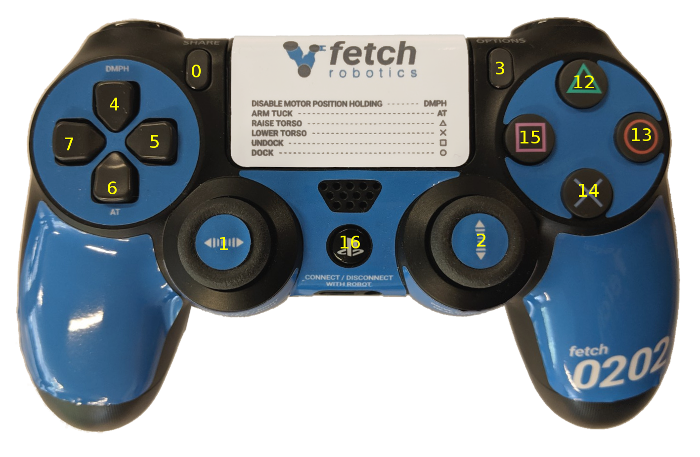
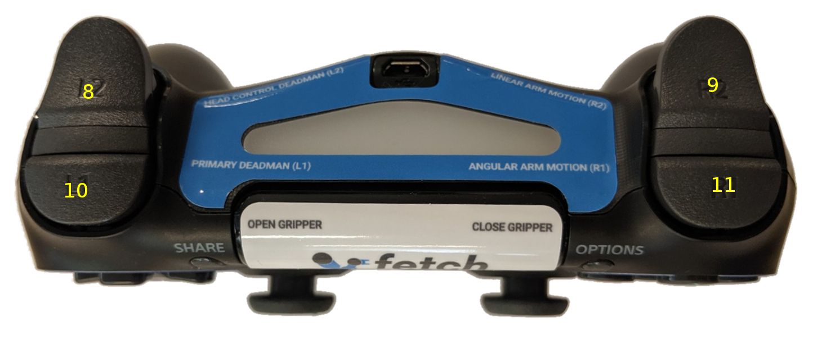

Tutorial: Robot Teleop
======================

Using the Robot Joystick
------------------------
.. embed-teleop-start

Each Fetch and Freight ship with a robot joystick.
Whenever the robot drivers are running, so is joystick teleop.
The joystick is capable of controlling the movement of the robot
base, torso, head and gripper.

.. warning:: Fetch robots use wireless controllers. As with any wireless
   technology, maximum range between controller and robot can vary
   depending on environment. You should experiment with your robot to
   understand the distance limit at which you can safely control your robot.

.. note:: If you are using the older PS3 controller a different
   version of this tutorial can be found :doc:`here </teleopPS3>`.

.. note:: To switch your robot to use a PS4 controller instead of
   a PS3 controller, see the instructions :doc:`here </ps4>`.

======== =================================
Button # Function (details below)
======== =================================
 0       Open gripper
 1       Control robot turning
 2       Control forward/backward driving
 3       Close gripper
 4       `Disable motor position holding <https://github.com/fetchrobotics/fetch_robots/blob/melodic-devel/fetch_bringup/scripts/controller_reset.py>`_
 5       Not used
 6       Arm tuck
 7       Not used
 8       Head control deadman
 9       Linear arm ("tooltip") control
 10      Primary deadman
 11      Angular arm ("tooltip") control
 12      Torso up
 13      Not used
 14      Torso down
 15      Not used
 16      Pair/unpair with robot
======== =================================

To pair the controller with the robot, press the middle button (16) once
the robot has powered on.  The controller will vibrate once successful.
To unpair, hold the button for 10 s.  The LED indicator on top will turn off.

To drive the robot base, hold the primary deadman button (button 10
above) and use the two joysticks. The left joystick controls turning
velocity while the right joystick controls forward velocity.

.. warning::

    Whenever driving the robot, always lower the torso and tuck
    the arm to avoid potentially unstable operation.

To control the head, release the primary deadman and hold the head
deadman (button 8). The left joystick now controls head pan while the right
joystick controls head tilt.

To move the torso up, hold the primary deadman and press the triangle
button (12). To move the torso down, hold the primary deadman and press
the X (14).

To close the gripper, hold the primary deadman and press the close
button (3). To open, hold the primary deadman and press the open
button (0).

The Fetch arm/gripper can be teleoped by combining several inputs:

- Linear motion of the end effector: Primary deadman + Button 9 + joystick input
- Angular motion of the end effector: Primary deadman + Button 11 + joystick input

Some controllers, such as the arm and head controllers, will attempt to
hold position indefinitely. Sometimes this is not desired. Holding button (4)
for 1 second will stop all controllers except the base controller and
the arm gravity compensation.

Moving the Base with your Keyboard
----------------------------------

.. note::

   You will need a computer with ROS installed to properly
   communicate with the robot. Please consult the `ROS Wiki <http://wiki.ros.org/melodic/Installation>`_
   for more information. We strongly suggest an Ubuntu machine
   with ROS Melodic installed.

To teleoperate the robot base in simulation, we recommend
using the ``teleop_twist_keyboard.py`` script from
`teleop_twist_keyboard <http://wiki.ros.org/teleop_twist_keyboard>`_
package.

::

  >$ export ROS_MASTER_URI=http://<robot_name_or_ip>:11311
  >$ rosrun teleop_twist_keyboard teleop_twist_keyboard.py

.. _software_runstop:

.. embed-teleop-end

Software Runstop
----------------

In addition to the runstop button on the side of the robot, similar software
functionality is also available, allowing for button presses on the
PS4 controller or a program to disable the breakers.
This functionality is available in release 0.7.3 of the
fetch_bringup package. The teleop portion is disabled by default.

Using Software Runstop
~~~~~~~~~~~~~~~~~~~~~~

To activate the software runstop, publish True to the /enable_software_runstop
topic.

Alternately, with the teleop runstop enabled, pressing both of the right
trigger buttons (buttons 9 and 11) will activate the software runstop.
The software_runstop.py script in fetch_bringup can be modified to change
the button(s) for the software runstop.

Once activated, the software runstop can be deactivated by (1) toggling the
hardware runstop, or (2) disabling the software runstop by passing False to
the /enable_software_runstop topic.

Enable Teleop Software Runstop
~~~~~~~~~~~~~~~~~~~~~~~~~~~~~~

.. note::

   In order to edit the robot.launch file, you will
   need to use a terminal editor (such as nano or vim), or use the -X flag
   with SSH to use a graphical editor (such as gedit). Additionally, the editor
   must be launched with ``sudo``. Instructions below use nano.

To enable the software runstop, first SSH into the robot, and then
modify the robot drivers launch file to use it.

We need to modify the robot.launch file to pass the correct arg to the
software runstop script:

::

  >$ sudo nano /etc/ros/melodic/robot.launch

In this file there should be a Software Runstop entry near the end. By default
this entry contains an args line, with a value of "-a -b -g". To add teleop
control, add the "-t" flag as well. This section will then look like the below.
If your robot is an older one and does not have a Software Runstop entry,
you will want to simply copy the block the below.

::

  <!-- Software Runstop -->
  <include file="$(find fetch_bringup)/launch/include/runstop.launch.xml">
    <arg name="flags" value="-a -b -g -t" />
  </include>

Note that the -a, -b, -g flags correspond to letting the software runstop
control the :ref:`arm, base and gripper breakers<breakers>`,
respectively.

Additionally, if completely disabling the software runstop functionality is
desired, the above section in robot.launch can be commented out or removed.

Finally, restart the drivers so that our changes take effect:

::

  >$ sudo service robot stop && sudo service robot start

Re-pairing Robot Joystick that Won't Connect
--------------------------------------------

For a Bluetooth PS4 controller, the controller can be re-paired through the
Ubuntu Bluetooth settings.  To put the controller in pairing mode, press and
hold the Share button, and then press and hold the center PS4 button for a
second and then release it, and then release the share button.  The LED on
the controller should start flashing twice, once per second.

Using Deadzone Parameter to Correct Drift
-----------------------------------------

Some controllers may have poorly-zeroed joysticks, meaning that they send a nonzero
value when the joystick is untouched and ought to send a zero value. This will be
apparent if you press the deadman button on the controller, and the robot slowly
moves without any input to the joysticks.

This behavior can be compensated for by using a rosparameter: **joy/deadzone**
(`ROS docs <http://wiki.ros.org/joy#Parameters>`__), which defines the amount by
which the joystick has to move before it is considered to be off-center, specified
relative to an axis normalized between -1 and 1.

Add/set the parameter in ``/etc/ros/melodic/robot.launch``::

  <!-- Teleop -->
    <include file="$(find fetch_bringup)/launch/include/teleop.launch.xml"/>
    <param name="joy/deadzone" value="0.1"/>

You can inspect the output of ``rostopic echo /joy`` with the controller
connected to choose an appropriate value for your controller.

To test a value after making the above change, with the arm safely resting
so that it won't fall, restart roscore.::

    sudo service roscore restart
