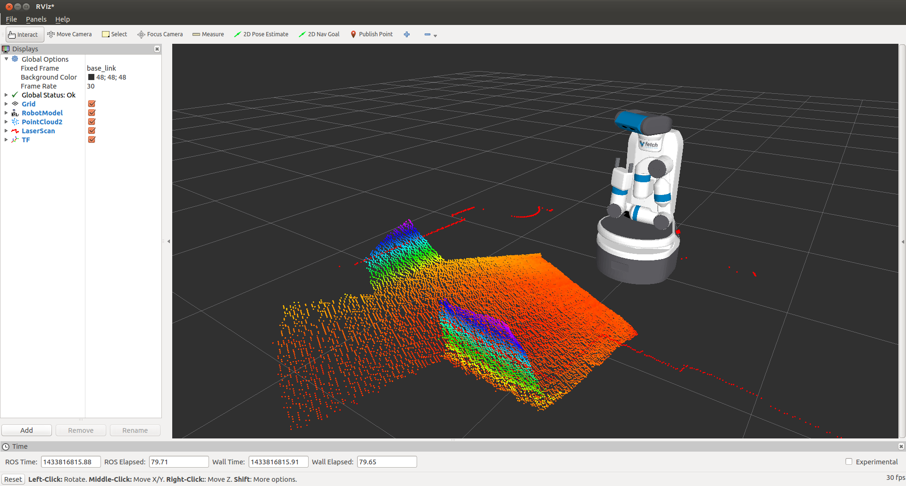
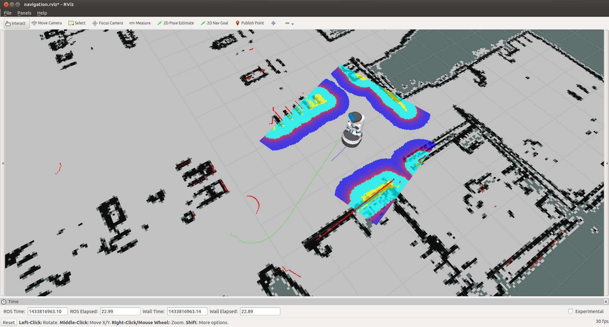
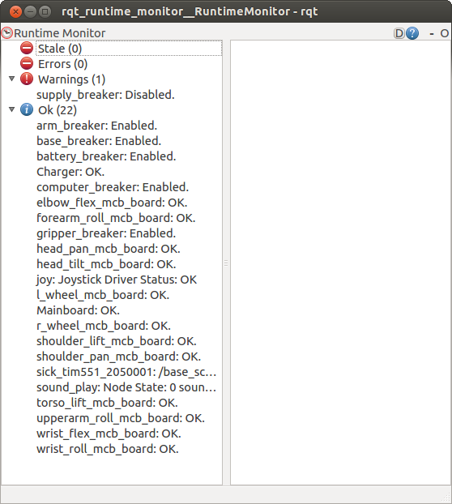
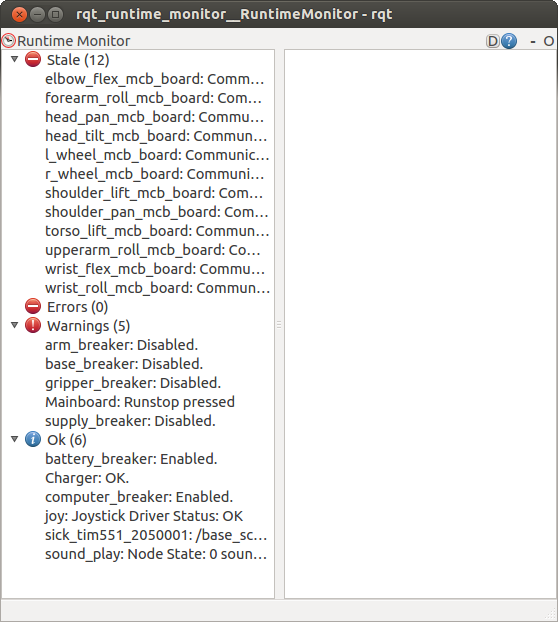

Tutorial: Visualization
=======================

.. _rviz:

Visualizing with RVIZ
---------------------

.. embed-rviz-start

::

    >$ export ROS_MASTER_URI=http://<robot_name_or_ip>:11311
    >$ rosrun rviz rviz

.. note::

   You will need a computer with ROS installed to properly
   communicate with the robot. Please consult the `ROS Wiki <http://wiki.ros.org/indigo/Installation>`_
   for more information. We strongly suggest an Ubuntu machine
   with ROS Indigo installed.

You can now `manually set up your RVIZ visualization
<http://gazebosim.org/tutorials?tut=drcsim_visualization&cat=drcsim#VisualizingtheRobotmodel>`_
or re-run RVIZ with a configuration file using the command line.
The default ``.rviz`` configuration file for Fetch can be loaded using:

::

    >$ roscd fetch_navigation/config
    >$ export ROS_MASTER_URI=http://<robot_name_or_ip>:11311
    >$ rviz -d navigation.rviz

.. embed-rviz-end
.. embed-runtime-monitor-start

Using the Runtime Monitor
-------------------------

Fetch and Freight publish ROS diagnostics messages. These are human-readable
messages that inform users of the robot system state. The `runtime_monitor`,
part of ``rqt_robot_plugins`` can be used to view diagnostics from your
desktop computer:

::

    >$ export ROS_MASTER_URI=http://<robot_name_or_ip>:11311
    >$ rosrun rqt_runtime_monitor rqt_runtime_monitor

The runtime monitor will have one entry per motor controller board (MCB),
as well as one entry per breaker. Each of these entries will be classified
as either stale, an error, a warning, or OK. In the above image,
the supply_breaker is disabled because the robot is not plugged in
-- this is only a warning, and not actually an issue.

Common errors that can be detected are overly hot motors or breakers,
breakers that have tripped. When the runstop on Fetch is pressed, a number
of breakers become disabled and the motor controller boards are turned
off, causing them to go stale. The below image shows what a runstopped
Fetch might look like:

.. embed-runtime-monitor-end
